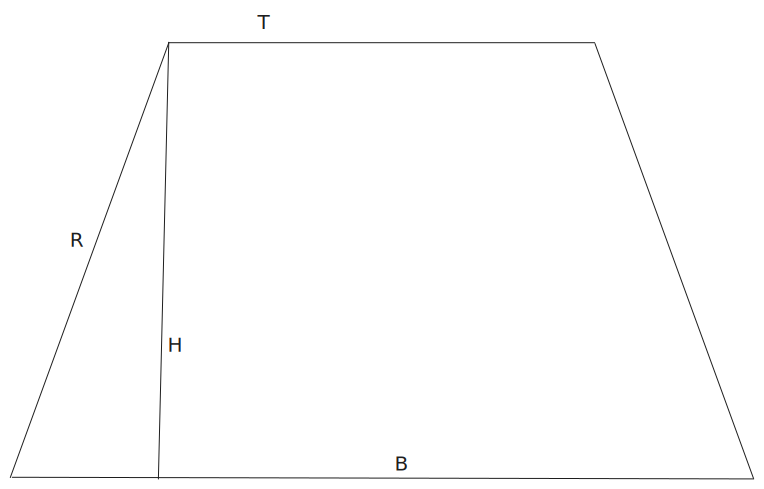
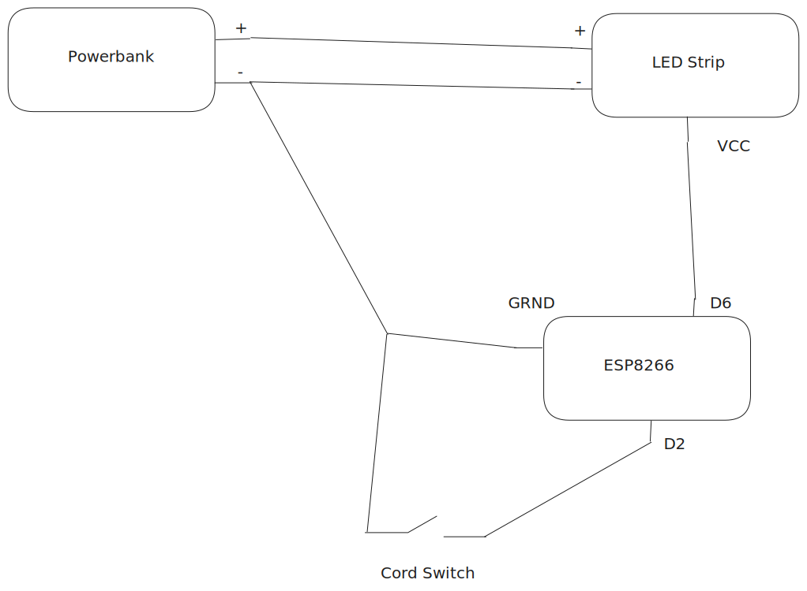

# Mothmans Favorite Lamp Costume
This is the summary/instruction of how I built my lamp costume (mothmans favorite lamp).

An image of the webinterface:

## Bill of Materials
The following things are needed to build the costume:
- 1x ESP8266 NodeMCUV2
- 1x Neopixel LED Strip (WS281x). I used [this](https://www.berrybase.at/adafruit-silikonummantelter-neopixel-led-streifen-60-leds-m-1m).
- 1x Powerbank (5V and at least 2.4A) I used [this](https://www.mediamarkt.at/de/product/_isy-ipp-10001-2006315.html)
- 1x foam rubber (1x1 meter? depending on the size you want to make)
- 1x resistor (300-500Ω) for the led strip data input connection (VCC)
- 1x usb C to pigtail cables (to connect the powerbank with the led strip) I used [this](https://www.amazon.de/RUNCCI-YUN-Stecker-stecker-Verl%C3%A4ngerungskabel-LED-Streifen/dp/B0CWNR95ZK?shipTo=AT).
- 1x shrink tubing
- 1x Black and Red Cables at least 22AWG
- 1x cord switch. I used [this](https://www.amazon.de/gp/product/B087RPZWS6?smid=A1V9KW8UN07CNM&psc=1).
- 1x micro usb cable (to program the esp and power it via the powerbank later on)

## Lamp Shade

To create the lamp shade I used the laml_shade_calculator.py script and entered the values at the top. 
The following drawing includes the variables used in the script to visualize which parts are affected.

The result of the script is an instruction on how to cut out the lampshade from the foam rubber.

To hold all the electronics I built a small cap by taping a plastic bag together in the form of my head.
After that I used another layer of tape to put all the electronics on it.
I sewed the led strip and cord switch onto the cap for extra stability.

Since I used black foam rubber, I also hot glued some white paper on the inside of the cone to increase the light reflection.

## Arduino Code
The arduino code contains the instructions to control the cord switch, the included web interface (to control the color of the leds and turn it off and on), and the connection to wifi. I used the WIFI hotspot from my phone which also meant I could control the lamp from my phone.

The code was flashed via Arduino IDE on to the esp.

### Circuit Diagram
The following contains the circuit diagram I "designed" (please don't judge the software dev for not using the correct symbols 👀):

### LittleFs
To include the actual html, css and image files on the esp webserver I used LittleFs, a tiny filesystem that can be used on an esp.
For this you first have to upload the files onto the esp, this can be done through various ways.
I used the arduino IDE plugin, and used the tutorial from here: https://randomnerdtutorials.com/arduino-ide-2-install-esp8266-littlefs/.

## References
The following tutorials/links were used to help me with the project:
- https://www.instructables.com/ESP8266-Connected-WS2812-RGB-LED-Controlled-Throug/
- https://lastminuteengineers.com/esp8266-wled-tutorial/
- https://www.omnicalculator.com/math/truncated-cone
- https://www.templatemaker.nl/en/cone/
- https://randomnerdtutorials.com/esp32-web-server-littlefs/
- https://randomnerdtutorials.com/arduino-ide-2-install-esp8266-littlefs/